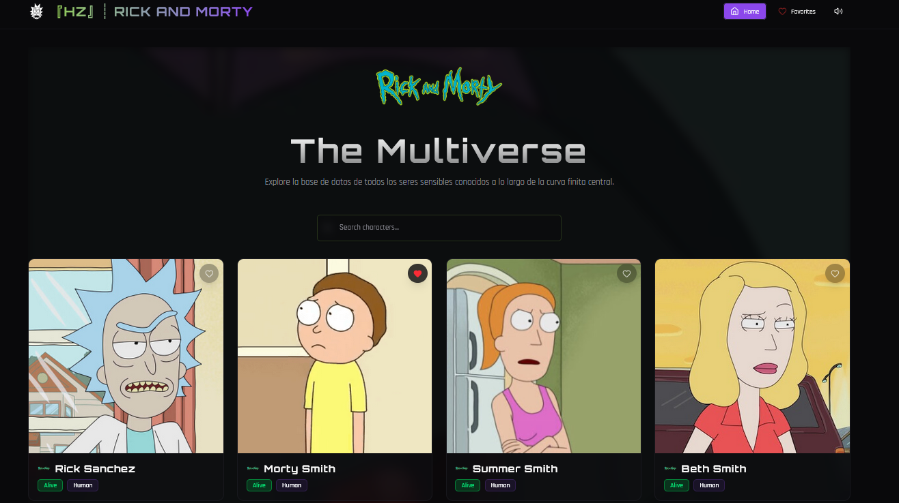
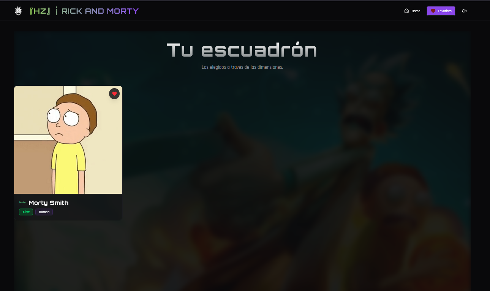
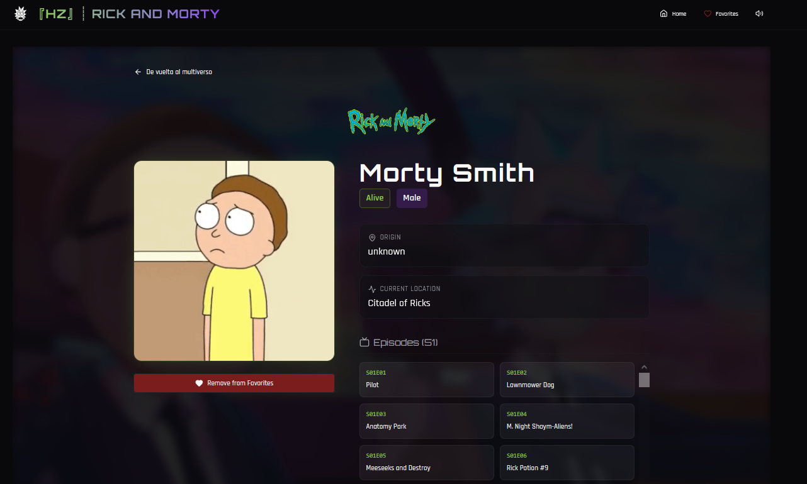
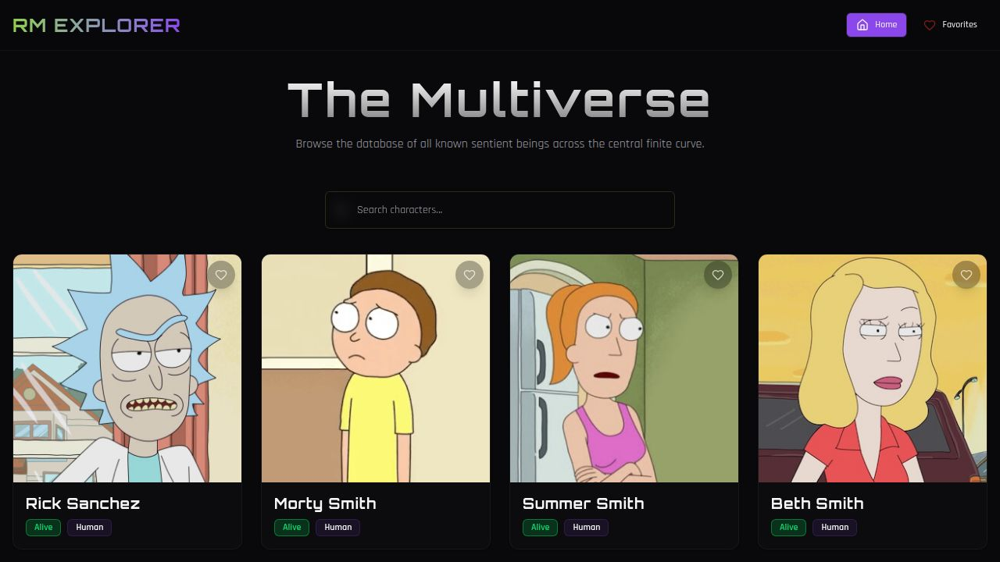

<p align="center">
  
</p>

<h1 align="center">Rick and Morty API Explorer</h1>

<p align="center">
  <a href="https://react.dev/" target="_blank">
    
  </a>
  <a href="https://vitejs.dev/" target="_blank">
    
  </a>
  <a href="https://www.typescriptlang.org/" target="_blank">
    
  </a>
  <a href="https://tailwindcss.com/" target="_blank">
    
  </a>
  <a href="https://tanstack.com/query/latest" target="_blank">
    
  </a>
</p>

<p align="center">
  ¡Bienvenido al Explorador del Multiverso de Rick and Morty! Esta aplicación te permite navegar, buscar y descubrir todos los personajes de la famosa serie, con una experiencia visual y sonora inmersiva.
</p>

## ✨ Características Principales

-   **Galería de Personajes**: Visualiza todos los personajes en una galería limpia y ordenada.
-   **Búsqueda Dinámica**: Encuentra personajes por nombre en tiempo real.
-   **Paginación Eficiente**: Navega fácilmente a través de cientos de personajes.
-   **Vista de Detalle de Personaje**: Haz clic en un personaje para obtener información completa, incluyendo su estado, especie, origen y episodios en los que aparece, con un fondo de video dinámico.
-   **Gestión de Favoritos**: Guarda tus personajes favoritos para acceder a ellos rápidamente en una sección dedicada con un fondo de video personalizado. Los favoritos se guardan localmente en tu navegador.
-   **Música de Fondo Ambiental**: Disfruta de una banda sonora inmersiva con controles de volumen y mute.
-   **Elementos de Diseño Estéticos**: Logos de Rick and Morty y de HedrichDev estratégicamente colocados para mejorar la experiencia visual.
-   **Diseño Adaptable (Responsive)**: Disfruta de una experiencia de usuario fluida tanto en dispositivos de escritorio como en móviles.

## 📸 Vistas Previa

<p align="center">
  
</p>
<p align="center">
  
</p>
<p align="center">
  
</p>
<p align="center">
  
</p>

## 🚀 Tecnologías Utilizadas

Este proyecto utiliza una arquitectura moderna y eficiente para ofrecer una experiencia de usuario de alta calidad.

### Frontend (`/client`)

-   **Framework**:  para construir la interfaz de usuario.
-   **Bundler**:  para un desarrollo rápido y un build optimizado.
-   **Lenguaje**:  para un código más robusto y escalable.
-   **Gestión de Estado del Servidor**:  para un fetching de datos, cacheo y sincronización eficientes.
-   **Estilos**:  para un diseño rápido y personalizable.
-   **Componentes UI**: Construido con , una colección de componentes reutilizables y accesibles.
-   **Routing**:  para una navegación ligera y eficiente entre páginas.
-   **Animaciones**:  para animaciones fluidas y declarativas.

### Backend (`/server`)

-   **Node.js**:  Se utiliza un servidor Node.js/Express (via `server/index.ts`) principalmente para servir los archivos estáticos del frontend en producción y actuar como proxy para el servidor de desarrollo de Vite. Actualmente, no implementa rutas API complejas.

### Compartido (`/shared`)

-   **Esquemas de Base de Datos**: Define la estructura de datos (ej. `users` y `posts` si se utilizaran) para la base de datos (Drizzle ORM).
    **⚠️ Nota de Seguridad**: El campo `password` en `shared/schema.ts` está actualmente configurado para almacenar contraseñas en texto plano. Si se planea implementar autenticación de usuarios, es **CRÍTICO** modificar esto para usar hashing con salting (ej. bcrypt) antes de cualquier uso en producción para evitar graves vulnerabilidades de seguridad.

## 🛠️ Instalación y Uso

Sigue estos pasos para configurar y ejecutar el proyecto en tu entorno local.

### Prerrequisitos

-   [Node.js](https://nodejs.org/) (versión 18.x o superior)
-   [npm](https://www.npmjs.com/) (generalmente incluido con Node.js)

### Pasos

1.  **Clona el repositorio:**
    ```bash
    git clone https://github.com/HedrichDev/RickMortyAPIExplorer
    cd RickMortyAPIExplorer
    ```

2.  **Instala las dependencias:**
    Este comando instalará todas las dependencias necesarias tanto para el cliente como para el servidor.
    ```bash
    npm install
    ```

3.  **Ejecuta el proyecto en modo de desarrollo:**
    Esto iniciará el servidor de desarrollo de Vite para el frontend y el servidor de Node.js/Express para el backend. Podrás ver la aplicación en `http://localhost:5173`.
    ```bash
    npm run dev
    ```

### Scripts Disponibles

-   `npm run dev`: Inicia los servidores de desarrollo para cliente y backend.
-   `npm run build`: Compila el cliente de React/Vite para producción en la carpeta `/dist`.
-   `npm start`: Inicia el servidor de Node.js/Express para servir el build de producción.
-   `npm run db:push`: Empuja los cambios del esquema de la base de datos (Drizzle ORM).

## ☁️ Despliegue en Netlify

Este proyecto está configurado para un despliegue sencillo en Netlify. Se incluye un archivo `netlify.toml` que define los siguientes ajustes:

-   **Build Command**: `npm run build`
-   **Publish Directory**: `dist`
-   **Fallback para SPA**: Configurado para manejar rutas de cliente (redirecciona `/*` a `/index.html`).

Para desplegar:
1.  Conecta tu repositorio a Netlify.
2.  Netlify detectará automáticamente el archivo `netlify.toml` y aplicará la configuración.

## 🤝 Contribuciones

Las contribuciones son bienvenidas. Si encuentras un error o tienes una mejora, por favor abre un 'issue' o envía un 'pull request'.

## 📝 Licencia

Este proyecto está bajo la Licencia MIT.

---

<p align="center">
  Hecho con ❤️ por <a href="https://github.com/HedrichDev" target="_blank" rel="noopener noreferrer">HΞDЯICHDΞV</a>
</p>

<p align="center">
  <a href="https://github.com/HedrichDev" target="_blank" rel="noopener noreferrer">
    
  </a>
</p>

## Video de Introducción

<p align="center">
  <video controls loop muted autoplay width="600">
    <source src="./client/public/Intro.mp4" type="video/mp4">
    Tu navegador no soporta el tag de video.
  </video>
</p>